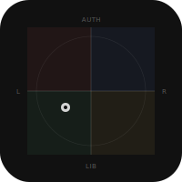

# Politics

Two-axis political compass test. Maps your position across economic (left/right) and social (libertarian/authoritarian) axes using 62 propositions across 6 categories. Single-file HTML app, no dependencies, no build step.

## Features
- 62 propositions across 6 sections (globalisation, economy, personal values, authority, religion, sex & society)
- Independent axis normalization (economic and social scored separately)
- SVG compass visualization with animated dot
- localStorage persistence (resume where you left off)
- Canvas-based share image generation
- Full ARIA accessibility (radiogroup, progressbar, aria-live)
- Mobile-first responsive layout
- Reduced motion support

## Run
```bash
open index.html
git push origin main
```
GitHub Pages or any static host.

## Roadmap
- [ ] Additional question categories
- [ ] Compare results with friends
- [ ] Historical figure placement overlay

## Changelog
### v1.0.0
- 62 propositions across 6 sections (globalisation, economy, personal values, authority, religion, sex & society)
- SVG compass visualization with animated dot
- localStorage persistence (resume where you left off)

## License
MIT 2026 Joshua Trommel
